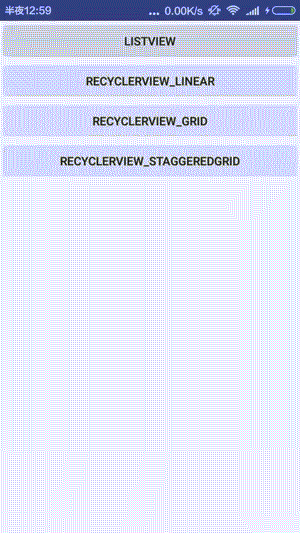
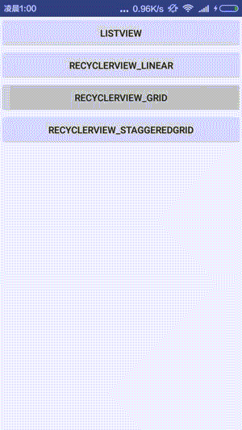
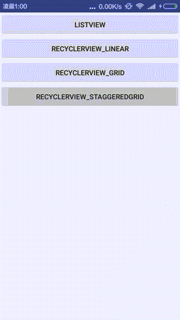

# ZAdapter
A listview and recyclerview can use the universal adapter 

#### [中文版文档](./README-cn.md)

### Solved problems 
- [x] Support adding head and bottom 
- [x] Support the pull up load with the load on the bottom of the view global switch with custom
- [x] Support for fast switching listview adapter to recyclerview adapter 
- [x] Setonitemlongclicklistener setonitemclicklistener support 
- [x] Reference base-adapter-helper so helper features similar to setonclicklistener only once can be used repeatedly, and the setonclicklistenerforce is forced to repeat the settings 
- [x] Recyclerview if you do not add headview or footerview can quickly support the animation operation 
- [x] Itemchanged:position data is changed 

### Unsolved problems 
- [x] Recyclerview if you add headview or footerview does not support the animation operation

# Usage

### JicPack
Add it in your root build.gradle at the end of repositories:

	allprojects {
		repositories {
			...
			maven { url "https://jitpack.io" }
		}
	}
Step 2. Add the dependency
> compile 'com.github.luhaoaimama1:ZAdapter:[Latest release](https://github.com/luhaoaimama1/ZAdapter/releases)'

# new Version Support
 Glide 3.7~[1.0.1]
 dependencies'com.android.support:recyclerview-v7:23.2.0' ~[1.0.2]
 add method:getData ~[1.0.3]

# Preview

###listView

### recyclerView mode: grid

### recyclerView mode: staggeredgrid

Easy use:
1.Adapter initialization quickadapter ---listView quickrcvadapter ----recyclerview  only replace this name!
  
     QuickAdapter adapter2 = new QuickAdapter<String>(this, mDatas) {
              @Override
              public void fillData(final Helper<String> helper, final String item, boolean itemChanged, int layoutId) {
                  helper.setText(R.id.tv, item).setBackgroundColor(R.id.tv, colorArry[helper.getPosition() % colorArry.length])
                          .setOnClickListener(R.id.tv, new View.OnClickListener() {
                              @Override
                              public void onClick(View v) {
                                  System.out.println("position:" + helper.getPosition());
                                  ToastUtils.showShort(ListViewActivity.this, "position:"+ helper.getPosition());
                              }
                          })
                          .setOnLongClickListener(R.id.tv, new View.OnLongClickListener() {
                              @Override
                              public boolean onLongClick(View v) {
                                  positonId = helper.getPosition();
                                  alert.show();
                                  return false;
                              }
                          });
              }
              @Override
              public int getItemLayoutId(String data, int position) {
                  return R.layout.item_menu;
              }
          };
          list.setAdapter(adapter2);

2.add headView footView setOnLoadMoreListener  setOnItemClickListener onItemLongClick's useage
  
               QuickManager.with(muliAdapter, rv)
                .addHeaderView(LayoutInflater.from(this).inflate(R.layout.header_simple, null))
                .addFooterView(LayoutInflater.from(this).inflate(R.layout.footer_simple, null))
                .setOnLoadMoreListener(new OnLoadMoreListener() {
                    boolean refesh = true;

                    @Override
                    public void onLoadMore() {
                        final List<String> mDatasa = new ArrayList<String>();
                        for (int i = 0; i < 5; i++) {
                            mDatasa.add("insert " + i);
                        }
                        handler.postDelayed(new Runnable() {
                            @Override
                            public void run() {
                                if (refesh) {
                                    muliAdapter.onLoadMoreComplete();
                                    muliAdapter.addAll(mDatasa);
                                } else {
                                    muliAdapter.onLoadMoreFail();
                                }
                                refesh = !refesh;
                            }
                        }, 1000);
                    }
                })
                .setOnItemClickListener(new IAdapter.OnItemClickListener() {
                    @Override
                    public void onItemClick(ViewGroup parent, View view, int position, long id) {
                        System.out.println("onItemClick position:" + position);
                    }
                }).setOnItemLongClickListener(new IAdapter.OnItemLongClickListener() {
            @Override
            public boolean onItemLongClick(ViewGroup parent, View view, int position, long id) {
                System.out.println("onItemLongClick position:" + position);
                return true;
            }
        }).perform();
        //this is ok,too;
        muliAdapter.addHeaderView(LayoutInflater.from(this).inflate(R.layout.header_simple, null));
        muliAdapter.addFooterView(LayoutInflater.from(this).inflate(R.layout.footer_simple, null));
3.Global configuration

    //Global replace loadmore view
    QuickConfig.setLoadMoreView(Class iLoadMoreFrameLayout)
    //global replace loadmore of scroll 's Mode
    QuickConfig.setLoadMoreMode(boolean mSCROLL_STATE_IDLE_ONLOADMORE)

#warning：
1.helper.setOnClickListener：  Not repeat   setonclick
  helper.setOnClickListenerForce：  repeat setonclick

2.Because item is a final type control reuse onclick will reuse the final class will not
 change and helper will not change, but the inside of the data do I always set the good so you use this on the line

3.have header or footer not use animation (method:.ani())

# Reference&Thanks：
https://github.com/JoanZapata/base-adapter-helper

https://github.com/tianzhijiexian/CommonAdapter

https://github.com/cundong/HeaderAndFooterRecyclerView

https://github.com/Frank-Zhu/AndroidRecyclerViewDemo

https://github.com/Syehunter/RecyclerViewManager
