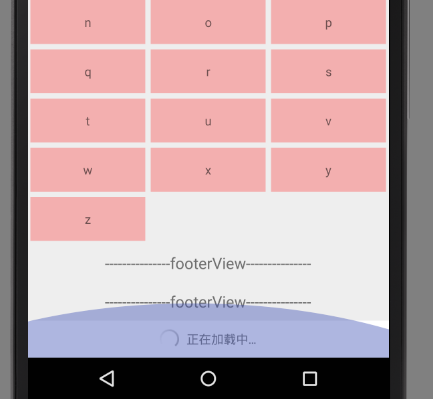

# ZAdapter
一个listView 和 recyclerView 都可以使用的万能adapter
### 已解决的问题
- [x] 支持添加头部和底部 
- [x] 支持上拉记载 与上啦加载底部view的全局切换与自定义
- [x] 支持快速将listview的适配器切换为recyclerView的适配器
- [x] setOnItemClickListener setOnItemLongClickListener的支持
- [x] 参考base-adapter-helper 所以helper功能类似 setOnClickListener 仅设置一次 可以重复使用 ，而setOnClickListenerForce则强制重复设置
- [x] recyclerView 如果不添加 headView 或者 footerView 可以快速支持动画操作
- [x] itemChanged:position的数据是否变化
### 未解决的问题
- [x] recyclerView 如果添加 headView 或者 footerView后 不支持动画操作

# Usage

### Jcenter
gradle

    compile 'com.zone:zadapter:1.0.0'
pom.xml

    <dependency>
     <groupId>com.zone</groupId>
     <artifactId>zadapter</artifactId>
     <version>1.0.0</version>
     <type>pom</type>
    </dependency>
    
# Preview

Easy use:
1.adapter的初始化  listView 用QuickAdapter recyclerView用QuickRcvAdapter
  
     QuickAdapter adapter2 = new QuickAdapter<String>(this, mDatas) {
              @Override
              public void fillData(final Helper<String> helper, final String item, boolean itemChanged, int layoutId) {
                  helper.setText(R.id.tv, item).setBackgroundColor(R.id.tv, colorArry[helper.getPosition() % colorArry.length])
                          .setOnClickListener(R.id.tv, new View.OnClickListener() {
                              @Override
                              public void onClick(View v) {
                                  System.out.println("position:" + helper.getPosition());
                                  ToastUtils.showShort(ListViewActivity.this, "position:"+ helper.getPosition());
                              }
                          })
                          .setOnLongClickListener(R.id.tv, new View.OnLongClickListener() {
                              @Override
                              public boolean onLongClick(View v) {
                                  positonId = helper.getPosition();
                                  alert.show();
                                  return false;
                              }
                          });
              }
              @Override
              public int getItemLayoutId(String data, int position) {
                  return R.layout.item_menu;
              }
          };

2.headView footView setOnLoadMoreListener  setOnItemClickListener onItemLongClick的使用
  
               QuickManager.with(muliAdapter, rv)
                .addHeaderView(LayoutInflater.from(this).inflate(R.layout.header_simple, null))
                .addFooterView(LayoutInflater.from(this).inflate(R.layout.footer_simple, null))
                .setOnLoadMoreListener(new OnLoadMoreListener() {
                    boolean refesh = true;

                    @Override
                    public void onLoadMore() {
                        final List<String> mDatasa = new ArrayList<String>();
                        for (int i = 0; i < 5; i++) {
                            mDatasa.add("insert " + i);
                        }
                        handler.postDelayed(new Runnable() {
                            @Override
                            public void run() {
                                if (refesh) {
                                    muliAdapter.onLoadMoreComplete();
                                    muliAdapter.addAll(mDatasa);
                                } else {
                                    muliAdapter.onLoadMoreFail();
                                }
                                refesh = !refesh;
                            }
                        }, 1000);
                    }
                })
                .setOnItemClickListener(new IAdapter.OnItemClickListener() {
                    @Override
                    public void onItemClick(ViewGroup parent, View view, int position, long id) {
                        System.out.println("onItemClick position:" + position);
                    }
                }).setOnItemLongClickListener(new IAdapter.OnItemLongClickListener() {
            @Override
            public boolean onItemLongClick(ViewGroup parent, View view, int position, long id) {
                System.out.println("onItemLongClick position:" + position);
                return true;
            }
        }).perform();
        //this is ok,too;
        muliAdapter.addHeaderView(LayoutInflater.from(this).inflate(R.layout.header_simple, null));
        muliAdapter.addFooterView(LayoutInflater.from(this).inflate(R.layout.footer_simple, null));

#warning：
1.helper.setOnClickListener：  Not repeat   setonclick
  helper.setOnClickListenerForce：  repeat setonclick

2.Because item is a final type control reuse onclick will reuse the final class will not
 change and helper will not change, but the inside of the data do I always set the good so you use this on the line

3.have header or footer not use animation (method:.ani())

# Reference&Thanks：
https://github.com/JoanZapata/base-adapter-helper

https://github.com/tianzhijiexian/CommonAdapter

https://github.com/cundong/HeaderAndFooterRecyclerView

https://github.com/Frank-Zhu/AndroidRecyclerViewDemo

https://github.com/Syehunter/RecyclerViewManager
